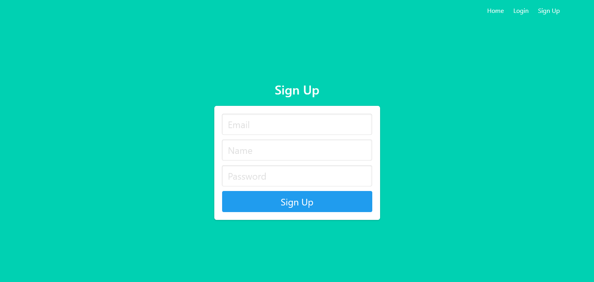
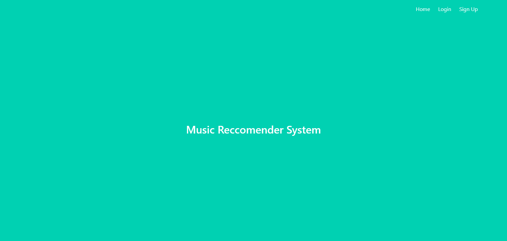
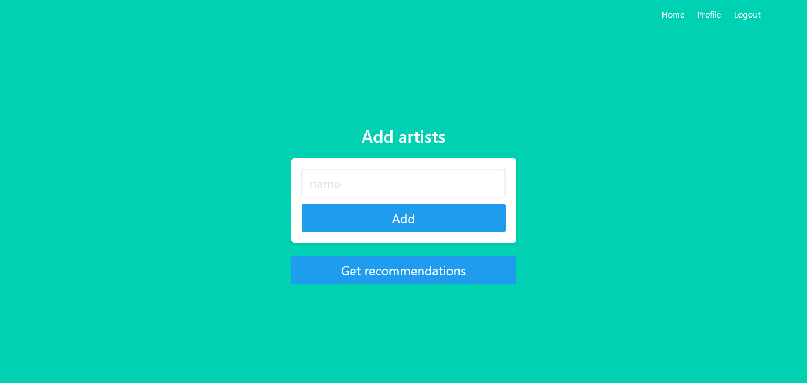
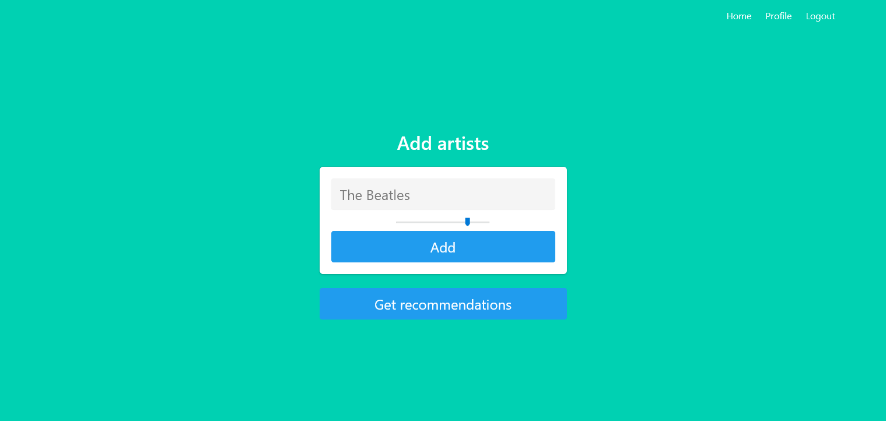
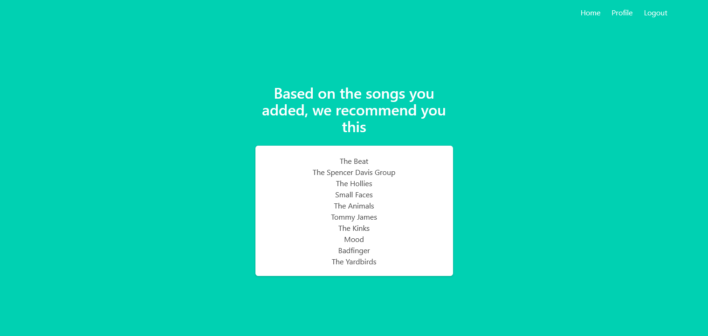

# Пояснювальна записка

## Зміст
1. [Вступ](#l1) 
   1.1. [Мета](#l11) 
   1.2. [Контекст](#l12) 
2. [Технічне завдання](#l2) 
   2.1. [Загальне завдання](#l21) 
   2.2. [Функціональність системи](#l22) 
3. [Проектування](#l3) 
   3.1. [Діаграма юзкейсів](#l31) 
   3.2. [Сценарії](#l32) 
   3.3. [Проектування інтерфейсу](#l33) 
4. [Розробка](#l4) 
   4.1. [Структура БД](#l41) 
5. [Тестування](#l5) 
6. [Висновки](#l6) 

## <a name="l1">1. Вступ</a>

Цей документ є пояснювальною запискою до проекту з курсу ІПЗ та містить опис вимог та процесу розробки рекомендаційної системи.

### <a name="l11">1.1. Мета</a>

Метою пояснювальної записки є визначення основних вимог до функціональності та експлуатаційної придатності, визначення бізнес-правил і можливих технологічних обмежень предмета розробки.

### <a name="l12">1.2. Контекст</a>

Вимоги, які зазначені у цьому документі, є основою технічного завдання проекту.

## <a name="l2">2. Технічне завдання</a>

### <a name="l21">2.1. Загальне завдання</a>

Розробити вебсайт, що надає можливість отримання рекомендованих музичних виконавців, базуючись на списку виконавців та оцінок, наданих користувачем.

### <a name="l22">2.2. Функціональність системи</a>

Користувач системи повинен мати можливості:
- створити обліковий запис
- ввійти в обліковий запис
- надавати оцінки музичним виконавцям
- переглядати список раніше оцінених виконавців
- отримувати список рекомендованих виконавців

## <a name="l3">3. Проектування</a>

### <a name="l31">3.1. Діаграма юзкейсів</a>

### <a name="l32">3.2. Сценарії</a>

#### Сценарій №1

***ID:*** UC.01
       
***НАЗВА:*** Реєстрація нового користувача

***УЧАСНИКИ:*** Користувач, Система

***ПЕРЕДУМОВИ:*** Користувач вирішив зареєструватись в системі

***РЕЗУЛЬТАТ:*** Створено обліковий запис користувача

***ВИКЛЮЧНІ СИТУАЦІЇ:***
 - EХ.001.001: Такий користувач вже є в системі
 - EX.001.002: Введено некорректні дані

***ОСНОВНИЙ СЦЕНАРІЙ:*** 
1. Користувач натискає кнопку "Реєстрація".
2. Система переодить на сторінку для реєстрації.
3. Користувач заповнює поля "Ім'я", "E-mail", "Пароль".
4. Користувач натискає кнопку "Зареєструватися".
5. Система перевіряє введені дані(можливі EX.001.001, EX.001.002).
6. Система додає введені дані до бази даних.
7. Користувач має новий обліковий запис.

#### Сценарій №2

***ID:*** UC.02
       
***НАЗВА:*** Авторизація

***УЧАСНИКИ:*** Користувач, Система

***ПЕРЕДУМОВИ:*** Користувач має обліковий запис

***РЕЗУЛЬТАТ:*** Користувач має доступ до свого облікового запису

***ВИКЛЮЧНІ СИТУАЦІЇ:***
 - EX.001.002: Введено некорректні дані
 - EХ.001.003: Користувач не зареєстрований в системі

***ОСНОВНИЙ СЦЕНАРІЙ:*** 
1. Користувач натискає на кнопку "Вхід в систему".
2. Система перенаправляє на сторінку входу в систему
3. Користувач заповнює поля "E-mail" та "Пароль".
4. Користувач натискає кнопку "Увійти".
5. Система перевіряє введені дані(можливі EX.001.002, EX.001.003).
6. Користувач отримує доступ до свого олікового запису.

#### Сценарій №3

***ID:*** UC.03
       
***НАЗВА:*** Додавання музичного виконавця

***УЧАСНИКИ:*** Користувач, Система

***ПЕРЕДУМОВИ:*** Користувач має обліковий запис та бажає додати виконавця до списку своїх вподобань

***РЕЗУЛЬТАТ:*** Користувач додав виконавця до списку вподобань

***ВИКЛЮЧНІ СИТУАЦІЇ:***
 - EХ.001.003: Користувач не зареєстрований в системі

***ОСНОВНИЙ СЦЕНАРІЙ:*** 
1. Користувач переходить на сторінку для додавання виконавця.
2. Користувач вводить ім'я виконавця.
3. Користувач натискає кнопку "Додати виконавця".
4. Система зберігає введене ім'я та перенаправляє користувача на сторінку для оцінки введеного виконавця.
5. Користувач отримує можливість оцінити виконавця(UC.04).

#### Сценарій №4

***ID:*** UC.04
       
***НАЗВА:*** Оцінка музичного виконавця

***УЧАСНИКИ:*** Користувач, Система

***ПЕРЕДУМОВИ:*** Користувач ввів ім'я виконавця та бажає оцінити виконавця щоб додати виконавця до списку своїх вподобань

***РЕЗУЛЬТАТ:*** Користувач додав виконавця з оцінкою до списку вподобань

***ВИКЛЮЧНІ СИТУАЦІЇ:***
 - EХ.001.004: Користувач не ввів ім'я перед переходом на сторінку

***ОСНОВНИЙ СЦЕНАРІЙ:***
1. Користувач оцінює виконавця за 10-бальною шкалою.
2. Користувач натискае кнопку "Оцінити".
3. Система записує ім'я та оцінку в базу даних(можлива EX.001.004).
4. Система повертає користувача на головну сторінку.
5. Користувач має збережені ім'я та оцінку виконавця для отримання кращих рекомендацій.

#### Сценарій №5

***ID:*** UC.05
       
***НАЗВА:*** Отримання рекомендацій

***УЧАСНИКИ:*** Користувач, Система

***ПЕРЕДУМОВИ:*** Користувач бажає отримати рекомендованих музичних виконавців

***РЕЗУЛЬТАТ:*** Користувач вже оцінив виконавців зі свого облікового запису

***ВИКЛЮЧНІ СИТУАЦІЇ:***
 - EХ.001.005: Користувач не оцінив жодного виконавця

***ОСНОВНИЙ СЦЕНАРІЙ:***
1. Користувач натискає кнопку "Отримати рекомендації".
2. Система формує список рекомендацій(можлива EX.001.005).
3. Система перенаправляє користувача на сторінку з рекомендаціями.
4. Користувач отримує список рекомендованих виконавців.

### <a name="l33">3.3. Проектування інтерфейсу</a>

**Головна сторінка для неавторизованого користувача**

**Сторінка реєстрації**

**Сторінка входу**

**Головна сторінка**

**Головна сторінка для авторизованого користувача**

**Сторінка оцінювання виконавця**

**Сторінка рекомендацій**

## <a name="l4">4. Розробка</a>

Система розроблема мовою програмування python з використанням Flask.

### <a name="l41">4.1. Структура БД</a>

## <a name="l5">5. Тестування</a>

## <a name="l6">6. Висновки</a>

В результаті виконання лабораторних робіт з курсу ІПЗ було розроблено рекомендаційну систему для музики, яка надає рекомендації базуючись на наданими корисрувачем оцінками виконавців.